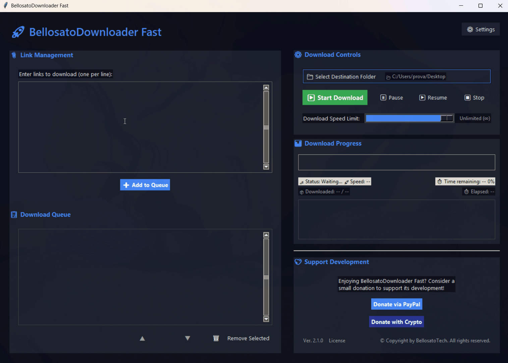
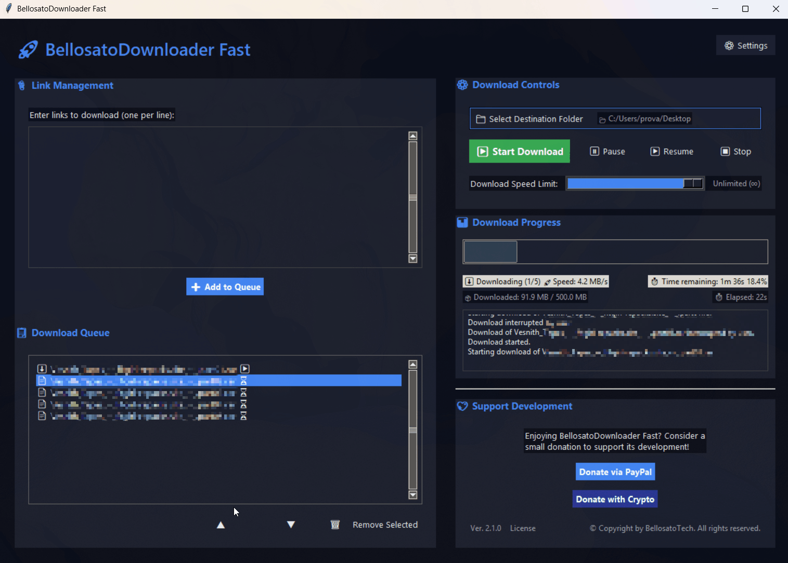

# BellosatoDownloader Fast

An intuitive desktop application for simplified direct download link extraction and management from web pages. Designed to automate and optimize the download process.

## ⚠️ Disclaimer

This software is developed solely for demonstrative and testing purposes. It is not intended for commercial use or real-world scenarios. Users are advised to use it responsibly and at their own risk.

## Features

- **Advanced Link Extraction**: Finds and validates direct download links from web pages (in some formats only).
- **Queue Management**: Add, manage, remove, and reorder multiple links, with duplicate detection and queue persistence.
- **Full Download Control**: Start, pause, resume, and stop downloads at any time.
- **Real-time Progress**: Monitor download speed, ETA, and file status with a progress bar and icons.
- **Modern UI**: A responsive, user-friendly interface with a dark theme, optimized layout, and custom scrollbars.
- **Advanced Settings**: Intuitive speed limit control (0-50 MB/s with Unlimited option), configurable download destination, and log file location with reset options.
- **Enhanced Download Details**: Real-time display of downloaded size, total size, elapsed time, and a mini-log for current downloads.
- **Support**: Includes a donation section with PayPal and separate crypto donation options.
- **Logging**: Keeps a log file for easier troubleshooting.

## 🚀 How to Use

1.  **Download the Executable:** Get the latest `BellosatoDownloaderFast.exe` from the [Releases section](https://github.com/BellosatoTech/BellosatoDownloaderFast-Releases/releases/latest).
2.  **Run the Application:** Double-click the downloaded `.exe` file.
3.  **Select Download Folder:** Click "Select Destination Folder" to choose where your files will be saved.
4.  **Add Links:** Paste web page URLs (one per line) into the "Link Management" text area and click "Add to Queue". The application will analyze them for direct download links.
5.  **Manage Queue:** Use the "▲" and "▼" buttons to reorder downloads, and "Remove Selected" to delete items.
6.  **Start Download:** Click "Start Download" to begin.

## 📸 Demos

### Main Workflow: Adding and Starting a Download

*This animation shows the process of selecting a destination folder, adding links to the queue, and starting a download.*

### Queue Management

This animation demonstrates how to reorder items in the queue and shows the option to save the list queue upon closing.

## 📄 License

This software is proprietary and all rights are reserved by BellosatoTech. It may not be copied, modified, or distributed without explicit permission. We plan to open-source the code for non-commercial use in a future major version.

## 📧 Contact

For any questions or support, feel free to open an issue on this repository. You can also find contact information on my GitHub profile.

---
*Developed with passion by BellosatoTech*
